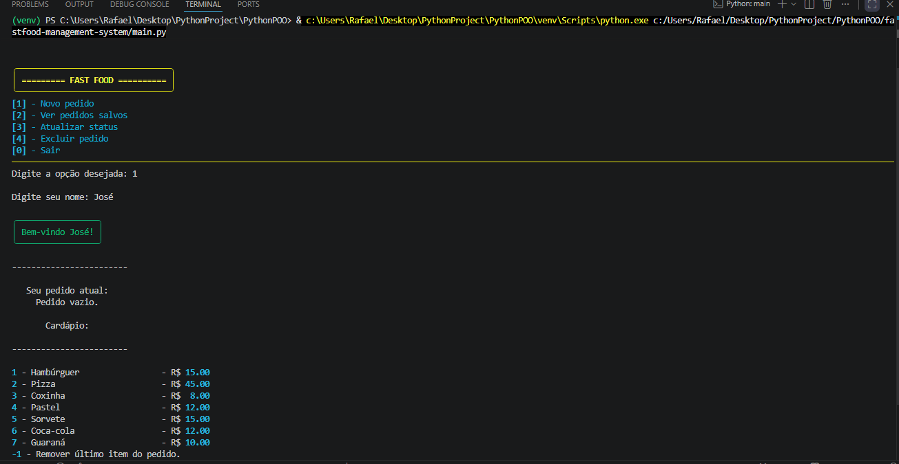
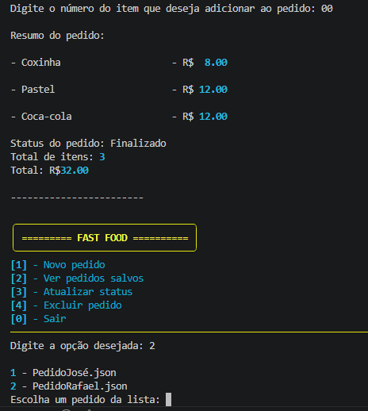
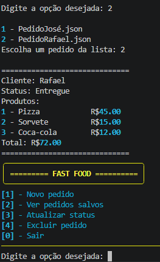
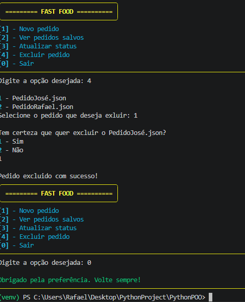

.# 🍔 Fast Food Management System

Sistema simples de gerenciamento de pedidos para fast food desenvolvido em **Python**, com armazenamento em **JSON** e interface no terminal utilizando a biblioteca **Rich**.

## 📌 Sobre o projeto

Este projeto foi desenvolvido com o objetivo de praticar conceitos fundamentais de Python, como:

* Funções
* Estruturas condicionais (`if`, `elif`, `else`)
* Laços de repetição (`while`, `for`)
* Manipulação de arquivos
* JSON
* Biblioteca `os`
* Biblioteca `rich`
* Organização de código
* Validação de entradas do usuário

O sistema permite criar, visualizar, atualizar e excluir pedidos de um fast food diretamente pelo terminal.

---

## 🚀 Funcionalidades

✅ Criar novo pedido
✅ Salvar pedidos em arquivos JSON
✅ Visualizar pedidos salvos
✅ Atualizar status do pedido
✅ Excluir pedidos
✅ Validação de entradas do usuário
✅ Interface visual no terminal com Rich

---

## 🛠️ Tecnologias utilizadas

* Python 3
* JSON
* Biblioteca `os`
* Biblioteca `rich`

---

## 📂 Estrutura do projeto

```bash
fastfood-management-system/
│── main.py
│── sistema_pedido.py
│── cliente.py
│── produto.py
│── pedido.py
│── pedidos/
│   ├── pedido_1.json
│   ├── pedido_2.json
```

---

## ▶️ Como executar o projeto

### 1. Clone o repositório

```bash
https://github.com/devrafael16/fastfood-management-system.git
```

### 2. Acesse a pasta do projeto

```bash
cd fastfood-management-system
```

### 3. Instale as dependências

```bash
pip install rich
```

### 4. Execute o sistema

```bash
python main.py
```

---

## 📸 Interface do sistema






---

## 📚 Aprendizados

Durante o desenvolvimento deste projeto, foram praticados conceitos importantes de Python como manipulação de arquivos, persistência de dados com JSON, organização de funções, validação de dados e estruturação de um sistema CRUD simples.

---

## 👨‍💻 Autor

Desenvolvido por Rafael Henrique como projeto de estudo em Python.
